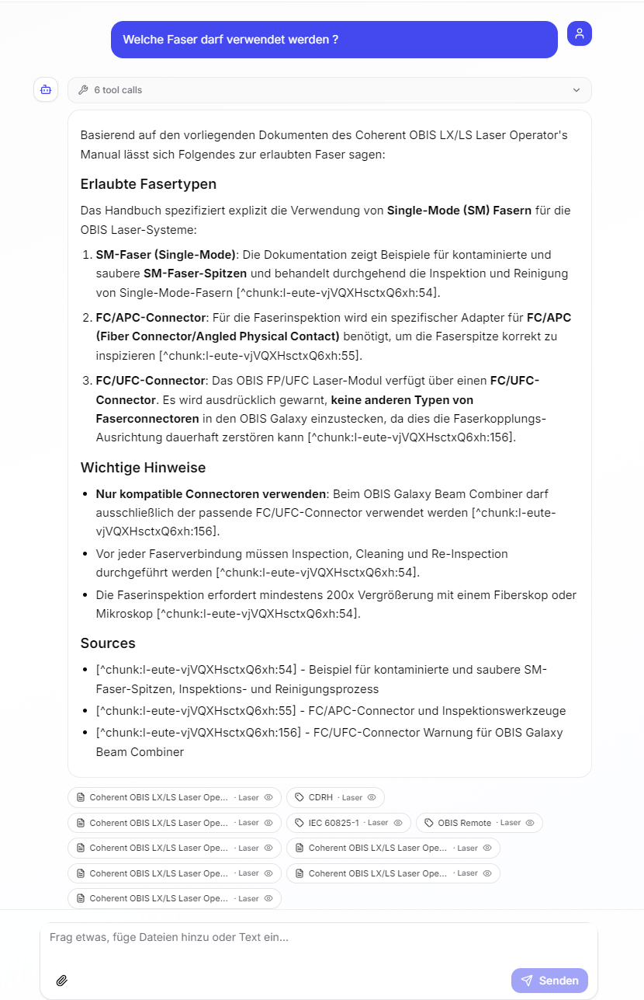
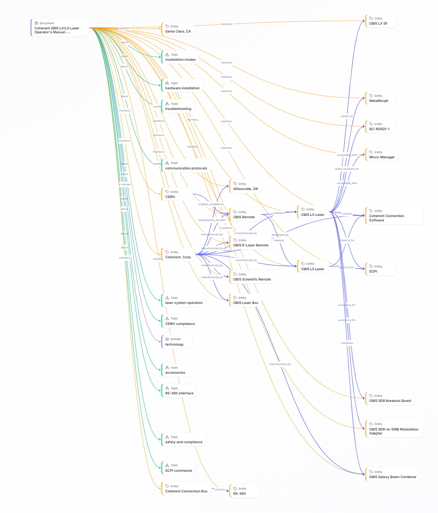
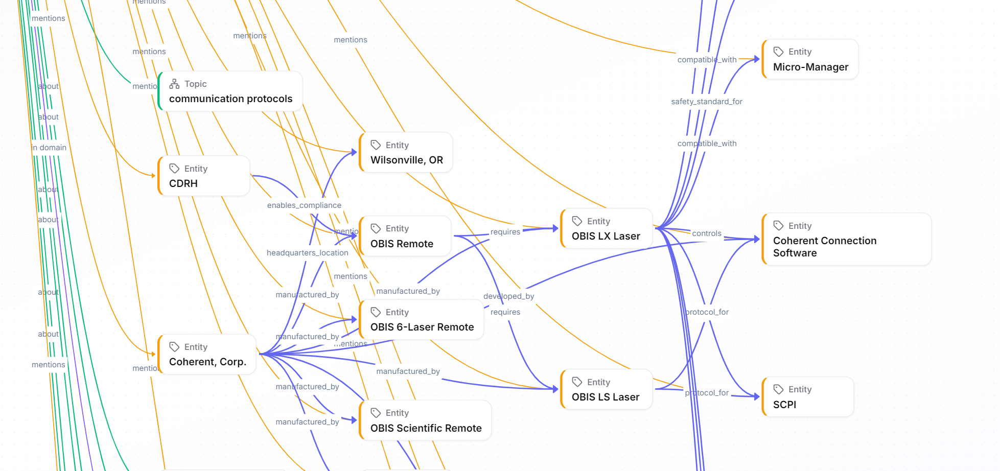
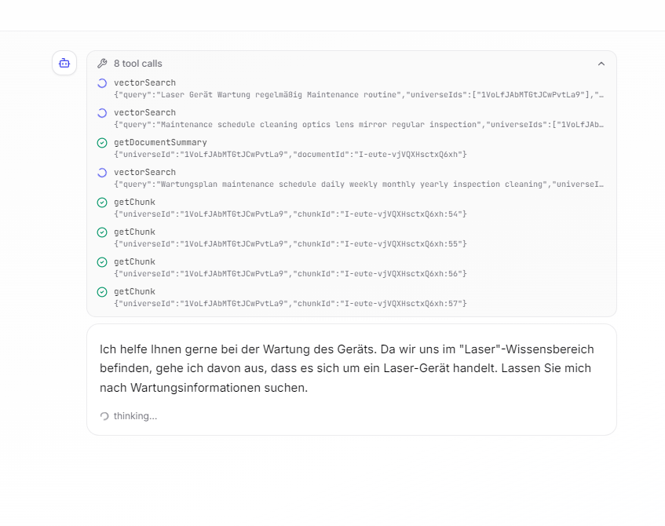
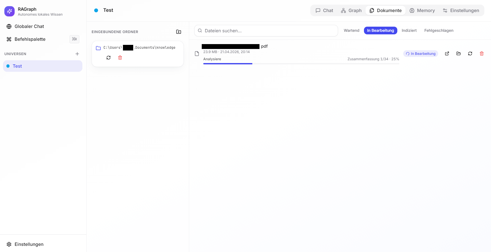
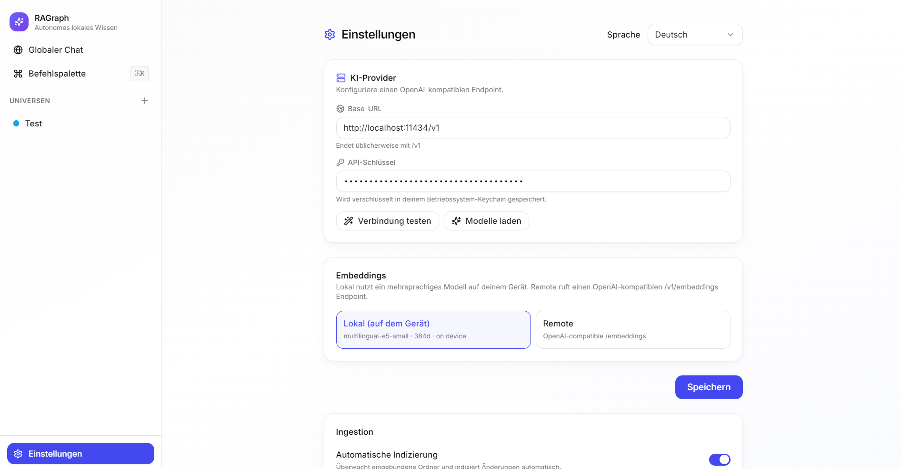

<div align="center">

# RAGraph

**A local-first, self-organizing knowledge system that reads, links and reasons over your documents — offline by default, cloud by choice.**

Combine the recall of a **vector database** with the structure of a **property graph**, driven by an **autonomous LLM agent** that browses its own knowledge like a researcher.

[](./LICENSE)
[](#packaging)
[](https://www.electronjs.org/)
[](https://react.dev/)
[](https://www.typescriptlang.org/)
[](#providers)
[](https://github.com/ADVASYS/ragraph/stargazers)

</div>

---

## Why RAGraph?

Classical RAG dumps every chunk it finds into the prompt. RAGraph treats knowledge the way a human would — it **reads**, **categorizes**, **links related things**, and **navigates** them step by step.

- **A graph, not a bucket.** Every ingested document spawns nodes and edges: topics become hierarchies (`PART_OF`), entities get merged under canonical identities with aliases, documents cite each other (`REFERENCES_DOC`), and a background consolidator keeps the structure clean.
- **Hybrid retrieval.** BM25 (SQLite FTS5) and vector search (LanceDB) are fused with Reciprocal Rank Fusion, then re-ranked through the graph neighborhood of the top hits.
- **Agentic reasoning.** The LLM decides when to search, when to expand a node, when to open a chunk, when to summarize a sub-thread, and when to write a note to its own memory — all through strongly-typed tools.
- **Verifiable citations.** Every claim is grounded in a source chip that opens the exact passage in the original PDF / DOCX / Markdown file at the right page and offset.
- **Your data stays yours.** SQLite files and LanceDB tables live in your user-data directory. API keys are encrypted through the OS keychain (`safeStorage`). You can run everything offline with a local embedder and a local OpenAI-compatible model (LM Studio, Ollama, llama.cpp, vLLM, …).

## Highlights

- Connect **any OpenAI-compatible endpoint** — OpenAI, Azure OpenAI, OpenRouter, Together, Groq, LM Studio, Ollama, llama.cpp server, vLLM, …
- Create unlimited **Universes** — each with its own graph, vector collection, chats, folder mounts and settings
- **Automatic ingestion** of watched folders: parse → chunk → structured LLM analysis → entity/topic resolution → embed → graph write → cross-document linking
- **Self-organizing knowledge graph** with embedding-based entity merging, topic clustering via `PART_OF`, document-similarity edges and degree-centrality
- **Autonomous RAG agent** with eleven typed tools, loop detection, per-tool timeouts and budget controls
- **Graph browser** with ELK layout, filters and neighborhood expansion; click-through to the originating document
- **Source viewer** for PDF/DOCX/MD/HTML/code with page, offset and heading-path awareness — highlights the quoted passage
- **Streaming multimodal chat** with markdown, KaTeX math, syntax-highlighted code, image and file attachments
- **Multilingual UI & agent** in **DE, EN, FR, ES** (the agent answers in the user's language by default)
- **Per-universe chat and global (cross-universe) chat** with RRF fusion across universes

## Screenshots

<p align="center">
  
</p>
<p align="center"><em>Answer grounded in six tool calls, every claim anchored to a <code>[^chunk:…]</code> citation that opens the exact passage in the source viewer.</em></p>

<table>
  <tr>
    <td width="50%" align="center">
      
      <br/><sub><b>Knowledge graph</b> — a freshly ingested PDF fans out into topics, entities, domains and typed relations (<code>manufactured_by</code>, <code>controls</code>, <code>compatible_with</code>, <code>requires</code>…).</sub>
    </td>
    <td width="50%" align="center">
      
      <br/><sub><b>Typed relations</b> — predicates extracted by the analyzer turn the graph into a queryable fact base, not just a bag of nodes.</sub>
    </td>
  </tr>
  <tr>
    <td width="50%" align="center">
      
      <br/><sub><b>Autonomous agent</b> — the RAG loop streams its <code>vectorSearch</code>, <code>getDocumentSummary</code> and <code>getChunk</code> calls live so you can audit how the answer was built.</sub>
    </td>
    <td width="50%" align="center">
      
      <br/><sub><b>Automatic ingestion</b> — mount a folder, watch the pipeline parse, chunk, analyze and index every file with live progress.</sub>
    </td>
  </tr>
  <tr>
    <td colspan="2" align="center">
      
      <br/><sub><b>Bring any provider</b> — OpenAI, Azure, OpenRouter, LM Studio, Ollama or llama.cpp. Embeddings run locally on-device by default with <code>multilingual-e5-small</code>.</sub>
    </td>
  </tr>
</table>

## Quick start

Requirements: **Node.js 20+**, npm.

```bash
git clone https://github.com/ADVASYS/ragraph.git
cd ragraph
npm install
npm run dev          # launches the app in development
```

On first launch an onboarding flow walks you through provider setup. Data is stored under the OS user-data directory, for example:

| OS | Data location |
| --- | --- |
| Windows | `%APPDATA%/RAGraph/ragraph/` |
| macOS | `~/Library/Application Support/RAGraph/ragraph/` |
| Linux | `~/.config/RAGraph/ragraph/` |

Inside that folder you will find the meta DB (`meta.sqlite`), per-universe graph DBs (`graph/<id>.sqlite`) and a LanceDB dataset per universe (`vectors/<id>/`).

### Available scripts

| Script | What it does |
| --- | --- |
| `npm run dev` | Hot-reload Electron dev server (`electron-vite dev`) |
| `npm run build` | Production build of main, preload and renderer |
| `npm run preview` | Preview the production build from `out/` |
| `npm run package` | Build platform installer(s) with `electron-builder` |
| `npm run package:dir` | Unpacked build for debugging native modules |
| `npm run typecheck` | Strict TypeScript check for node and web projects |
| `npm run lint` | ESLint across the repo |
| `npm run test` | Vitest unit tests |
| `npm run test:e2e` | Playwright end-to-end tests |

## Providers

RAGraph is provider-agnostic. You configure:

1. A **chat provider** (`baseUrl`, `apiKey`, `chatModel`) — any endpoint compatible with OpenAI's `/v1/chat/completions`.
2. An **embedder**. Either:
   - **Local** (default): `multilingual-e5-small` via `@huggingface/transformers` running on WebAssembly/WebGPU — no data leaves the machine.
   - **Remote**: any OpenAI-compatible `/v1/embeddings` endpoint.

Fully offline stacks are supported, e.g.:

- Chat: Ollama (`http://localhost:11434/v1`) with `llama3.1`, `qwen2.5`, `mistral-nemo`, …
- Embeddings: local `multilingual-e5-small` (bundled) or Ollama's `nomic-embed-text`.

API keys are encrypted at rest through Electron `safeStorage`, which uses the OS keychain (Keychain on macOS, DPAPI on Windows, `libsecret` on Linux).

## How it works (in one picture)

```text
             ┌─────────────────────────── User ───────────────────────────┐
             │                                                            │
             ▼                                                            ▼
     Drops a folder                                             Asks a question
             │                                                            │
             ▼                                                            ▼
 ┌─────────────────────┐                                  ┌──────────────────────────┐
 │   Watcher + Queue   │                                  │    RAG Agent (Vercel AI) │
 │    (chokidar)       │                                  │  streamText + 11 tools   │
 └─────────┬───────────┘                                  └────────────┬─────────────┘
           ▼                                                           ▼
   Parser → Chunker → Analyzer (structured LLM)       vectorSearch / graphNavigate /
           │                                           entitySearch / findPath / …
           ▼                                                           │
   EntityResolver  (embedding-based merging)                           │
           │                                                           ▼
           ▼                                       Hybrid search (BM25 + Vector)
 ┌────────────────────┐   ┌────────────────────┐          │
 │     GraphStore     │   │    VectorStore     │          ▼
 │ SQLite + FTS5      │   │  LanceDB           │   Graph expansion
 │ nodes / edges /    │   │  chunks / summaries│          │
 │ nodes_fts          │   │  entities / topics │          ▼
 └─────────┬──────────┘   └─────────┬──────────┘   RRF fusion (cross-universe)
           └───────── links ────────┘                      │
                     │                                     ▼
                     ▼                            Streaming answer
         Background GraphConsolidator            with inline [^source:…]
         (clusters entities, PART_OF,
          SIMILAR_TO, centrality)
```

## Feature tour

### Universes
A universe is a self-contained knowledge space with its own graph, vector collection, folder mounts, chats and agent memory. Keep "Work", "Research" and "Private" separated — or keep a single universe and let it grow. Universes are coloured, renamable, and cheap to create.

### Automatic ingestion
Mount a folder and RAGraph watches it with `chokidar`. Every add/change/remove event is diffed against the SQLite file table via SHA-256 and only new or changed files are queued. The pipeline parses PDF/DOCX/Markdown/HTML/text/code, chunks with heading awareness, calls the LLM for structured extraction (`title`, `summary`, `topics[]`, `entities[]`, `keywords[]`, `references[]`, `relations[]`), resolves entities and topics against the existing graph, embeds, and writes everything atomically. Failures are isolated per file — a broken PDF never blocks the queue.

### Self-organizing graph
See [`docs/self-organization.md`](./docs/self-organization.md). Entity merging is embedding-based (not surface-form), topic hierarchies emerge from explicit extraction plus agglomerative clustering, and a background consolidator maintains centrality and `SIMILAR_TO` edges between documents that share entities.

### Retrieval
See [`docs/retrieval.md`](./docs/retrieval.md). Three stages: **hybrid fusion** (RRF of BM25 + vector), **graph expansion** (neighborhood-weighted re-ranking), **cross-universe fusion** (a second RRF when the global chat spans multiple universes). All thresholds are configurable from Settings → Knowledge graph.

### Autonomous agent
See [`docs/rag-pipeline.md`](./docs/rag-pipeline.md). The agent has a rubric for choosing between `vectorSearch`, `entitySearch`, `findPath`, `findRelatedDocs`, `topicHierarchy`, `graphNavigate`, `getDocumentSummary`, `getChunk`, `summarizeSubthread`, `saveAgentNote` and `recallAgentMemory`. Every tool is Zod-validated, wrapped with a timeout and a loop detector, and streams tool-call updates to the UI live.

### Verifiable citations & source viewer
Citations are rendered inline as clickable `[^source:…]` chips. Clicking a chip opens the **SourceViewer** at the exact chunk — with page number for PDFs, heading path for Markdown/HTML/DOCX, and char offsets for raw text — and highlights the quoted passage.

### Graph browser
Navigate the graph visually with `@xyflow/react` + `elkjs` for layout. Filter by node type or relation, expand a neighborhood, search by name, and jump into the source viewer straight from a `Document` node.

## Architecture overview

```text
ragraph/
├── electron/
│   ├── main/
│   │   ├── core/                       # Framework-independent domain core
│   │   │   ├── providers/              #   LLM + Embedder (local/remote, E5 task-prefixing)
│   │   │   ├── storage/                #   MetaDatabase, GraphStore (SQLite+FTS5), VectorStore (LanceDB)
│   │   │   ├── knowledge/              #   EntityResolver + GraphConsolidator
│   │   │   ├── ingestion/              #   Parser, Chunker, Analyzer, Watcher, IngestionPipeline
│   │   │   └── rag/                    #   Agent + tools (Zod-typed, safety-shell)
│   │   ├── services/AppContext.ts      # Long-lived orchestrator owned by main
│   │   ├── ipc/                        # Typed IPC handlers (ipcMain.handle only)
│   │   └── index.ts                    # BrowserWindow, CSP, safeStorage
│   └── preload/                        # contextBridge exposing a narrow `window.api`
├── src/                                # React 18 renderer
│   ├── app/                            #   Shell, routing, global Zustand store
│   ├── features/                       #   settings · universes · chat · graph-browser · documents · memory · commands
│   ├── components/ui/                  #   shadcn-style primitives (unstyled + Tailwind)
│   ├── i18n/locales/                   #   DE · EN · FR · ES
│   └── styles/                         #   Tailwind tokens + globals
├── shared/                             # Cross-process types and IPC channel identifiers
├── docs/                               # Full documentation (English)
└── tests/                              # Vitest units + Playwright e2e
```

Strict rules keep the core portable:

- `electron/main/core/**` **never** imports Electron or IPC.
- The renderer **never** accesses Node directly. Everything goes through `window.api`.
- Cross-process DTOs live in `shared/types.ts`; channel names in `shared/ipc.ts`.

See [`docs/modules.md`](./docs/modules.md) for the full conventions.

## Security & privacy

- `contextIsolation: true`, `nodeIntegration: false`, `sandbox: true` where possible.
- Strict CSP in `src/index.html` restricts scripts to `self`.
- All SQL is prepared-statement based; LanceDB literals are escape-validated (`VectorStore.escapeSqlLiteral`).
- FTS queries pass through `sanitizeFtsQuery` which strips FTS5 operators and quotes every token.
- API keys are encrypted through `safeStorage` and never written in plain text to disk.
- No telemetry is sent. The only outbound network traffic is the one you configure (chat + embedding endpoints).

## Data model (one-pager)

Nodes: `Document`, `Chunk`, `Topic`, `Domain`, `Keyword`, `Entity`, `AgentNote`
Edges: `CONTAINS`, `ABOUT`, `IN_DOMAIN`, `TAGGED`, `MENTIONS`, `RELATED`, `PART_OF`, `REFERENCES_DOC`, `SIMILAR_TO`, `DERIVED_FROM_DOC`
Full-text: contentless FTS5 virtual table `nodes_fts` with shadow table `fts_refs(rowid, source_id, kind)`.

Details and properties are in [`docs/graph-schema.md`](./docs/graph-schema.md).

## Configuration surface

All knobs live in Settings and in `AppSettings` (`shared/types.ts`):

| Section | Keys |
| --- | --- |
| Provider | `baseUrl`, `apiKey`, `chatModel`, `visionModel`, `embeddingMode`, `embeddingModel`, `embeddingBaseUrl`, `embeddingApiKey` |
| Agent | `maxSteps`, `toolTimeoutMs`, `maxSources`, `loopDetection` |
| Graph | `hybridEnabled`, `graphExpansionEnabled`, `graphExpansionDepth`, `graphExpansionWeight`, `entityMergeThreshold`, `topicMergeThreshold`, `referenceMatchThreshold` |
| General | `language`, `concurrency`, `autoIngest` |

Defaults are tuned for `multilingual-e5-small` embeddings; bump `entityMergeThreshold` if you notice over-merging with a stronger encoder.

## Documentation

| Doc | What's inside |
| --- | --- |
| [Architecture](./docs/architecture.md) | Process model, layers, security, event streams |
| [Module conventions](./docs/modules.md) | Hard rules for core, features and IPC |
| [RAG pipeline](./docs/rag-pipeline.md) | Tool catalogue, execution loop, context budgeting |
| [Ingestion](./docs/ingestion.md) | File lifecycle from watcher to graph |
| [Graph schema](./docs/graph-schema.md) | Node and edge types, SQL schema, conventions |
| [Retrieval](./docs/retrieval.md) | Hybrid fusion, graph expansion, cross-universe RRF |
| [Self-organization](./docs/self-organization.md) | Entity merging, topic clustering, consolidator |
| [IPC contract](./docs/ipc.md) | Channel reference for main ↔ renderer |
| [Internationalization](./docs/i18n.md) | i18next setup, adding keys, four locales |
| [Packaging](./docs/packaging.md) | electron-builder targets, signing, auto-update |

## Tech stack

- **Electron 33** with `electron-vite`, `electron-log` and `electron-updater`
- **React 18** · TypeScript 5.6 · **Tailwind CSS** · shadcn-style Radix primitives
- **Zustand** for UI state · **TanStack Query** for async cache
- **@xyflow/react** + **elkjs** for graph visualization
- **Vercel AI SDK** (`ai`, `@ai-sdk/openai-compatible`) for LLM streaming and tools
- **better-sqlite3** with **FTS5** for the property graph and full-text search
- **LanceDB** (`@lancedb/lancedb`) for embeddings, with Apache Arrow I/O
- **@huggingface/transformers** for local `multilingual-e5-small` embeddings
- **chokidar** for folder watching, **p-queue** for ingestion concurrency
- Parsers: **pdf-parse**, **mammoth**, **marked** + **gray-matter**, **node-html-parser**
- **react-markdown** with GFM, math (KaTeX), syntax highlighting
- **framer-motion**, **lucide-react**, **sonner** for UX details
- **Vitest** for units, **Playwright** for e2e

## Contributing

Contributions are welcome. Please:

1. Open an [issue](https://github.com/ADVASYS/ragraph/issues) to discuss non-trivial changes first.
2. Follow the [module conventions](./docs/modules.md) — especially the core-independence rule.
3. Add i18n keys to all four locales when you add UI strings.
4. Run `npm run typecheck && npm run lint && npm run test` before opening a PR.

For UI work, follow the design guidelines in `docs/modules.md` §5 (8pt grid, Lucide icons only, no text glyphs, Tailwind tokens from `src/styles/globals.css`).

## Support & community

- Questions / ideas → [GitHub Discussions](https://github.com/ADVASYS/ragraph/discussions)
- Bugs → [GitHub Issues](https://github.com/ADVASYS/ragraph/issues)
- Security reports → open a private advisory on GitHub, please do **not** file public issues for vulnerabilities.

## Roadmap

- Export/import a universe as a portable bundle (graph + vectors + mounts)
- Multi-modal image indexing via a local CLIP-style encoder
- Plug-in architecture for custom parsers and analyzers
- Collaborative universes over CRDT sync
- First-class audio ingestion (Whisper-compatible endpoint)

## License

MIT — see [`LICENSE`](./LICENSE).
